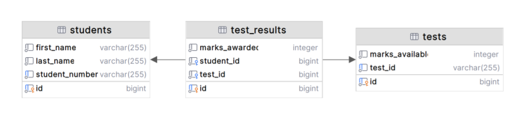

# Markr - Marking as a Service

This repository contains Szymon Szukalski's submission to the Stile Coding Challenge.

This document describes:
1. How to run and test the project
2. Assumptions
3. Approach Taken
4. Next Steps and Recommendations

## Running the Project

This project uses Docker for containerization.

### Docker CLI Version

The project uses the latest version of the Docker CLI (version 27.1), which includes the integrated `docker compose`  
command for managing multi-container Docker applications.

### Build

To build the Docker image for the application, run the following command:

```shell  
docker compose build
```  

This command will build the application image using the Dockerfile defined in the project.

### Test

To run the tests using Docker, use the following command:

```shell  
docker compose run --rm tests
```  

This command will build the Docker image (if not already built), start a container for testing, and run the tests. The  
--rm flag ensures that the test container is removed after the tests complete.

### Run

To run the application, use the following command:

```shell  
docker compose up postgres service
```  

This command will start the application and its dependencies (like PostgreSQL) as defined in the docker-compose.yml  
file.

### Testing from the command-line

Once the application is up and running, you can run some command-line tests using `curl`.

To import the sample results:

```shell
cd data
curl -X POST http://localhost:8080/import -H "Content-Type: text/xml+markr"  --data-binary "@sample-results.xml"
HTTP/1.1 200 
Content-Type: application/json
Transfer-Encoding: chunked
Date: Fri, 26 Jul 2024 05:56:28 GMT

{"status":"success","message":"Import completed successfully","data":{"studentsCreated":0,"studentsUpdated":0,"testsCreated":0,"testsUpdated":0,"testResultsCreated":0,"testResultsUpdated":0}}
```
To aggregate the results:

```shell
curl -i -X GET http://localhost:8080/results/9863/aggregate
HTTP/1.1 404 
Content-Length: 0
Date: Fri, 26 Jul 2024 06:06:22 GMT
```

### Cleanup

To stop the running containers and remove them along with associated volumes, use:

```shell  
docker compose down -v
```  

This command will stop and remove the containers and any associated volumes.

## Assumptions

**Deployment**
- Encryption is not required
- Authentication is not required
- This is a standalone service used by a single institution
    - In order to support multiple institutions, the test results would need to be tied to the institution somehow.
- Imported data should persist between restarts of the service

**Import endpoint**
- That all the fields in the supplied XML document are mandatory and cannot be blank
- That the `student-id` is unique
- That marks obtained will never be higher than marks available
- Ignoring the `<answer/>` elements during import as all the necessary information is contained in the `<summary-marks/>` elements
- The endpoint may receive other XML documents which don't conform to the samle XML format and that they should be rejected.
- Duplicate entries should be handled gracefully

**Aggregate endpoint**
- That standard deviation is a requirement as it is included in the expected output:

```shell
curl http://localhost:4567/results/1234/aggregate
{"mean":65.0,"stddev":0.0,"min":65.0,"max":65.0,"p25":65.0,"p50":65.0,"p75":65.0,"count":1}
```

## Approach

- Implemented the application using Spring Boot, leveraging my Java background and the framework’s ease of setup for microservices.
- Created Java classes to represent the XML payloads
- Used PostgreSQL for data storage
- Used in-memory H2 database for integration testing
- Designed entity models for Student, Test, and TestResult to map database tables and manage relationships.
- Applied common Spring patterns:
    - Used JPA for ORM to interact with the PostgreSQL database.
    - Defined RESTful endpoints with RestController to handle HTTP requests.
    - Created repository interfaces for managing CRUD operations.
    - Encapsulated business logic in service classes to maintain separation of concerns.
- Developed unit and integration tests to validate REST endpoints and service functionality.
- Set up a multi-stage Docker Compose file to build, test, and run the application independently, supporting CI/CD pipelines.

**Data Model**



## Next Steps / Recommendations

**Codebase Maturity**
- Document the API with endpoint details, request/response examples, error handling, and authentication.
- Expand test-suite with more test cases
- Integrate into CI/CD

**Security and Monitoring**
- Implement SSL, encryption, and authentication to secure communication, encrypt data at rest, and control access.
- Create health check endpoints to monitor service status and integrate with an observability platform.
- Implement real-time performance monitoring to track system responsiveness and resource usage. 

**Performance**
- Use profiling tools to identify and resolve performance bottlenecks in data processing and display.
- Index frequently queried fields to speed up query execution.
- Review and optimize SQL queries to reduce execution time.

**Supporting Real-time Dashboards**
- Implement real-time data streams with technologies like Apache Kafka or WebSockets to push live updates.
- Set up an event-driven architecture to automatically refresh the dashboard when new data becomes available.
- Calculate and store aggregate data in advance to speed up updates and reduce processing during real-time refreshes.
- 
**Alternate Pipeline Approach**
- Use an ELT approach by storing the original XML payload in block storage before loading and transforming it.
- Storing the original XML payload enables updating the transformation logic and reprocessing the original data with new logic if needed.
- Leverage the event-driven architecture to facilitate replaying and correcting results if bugs are fixed in the transformation logic, allowing for data reprocessing and validation.
